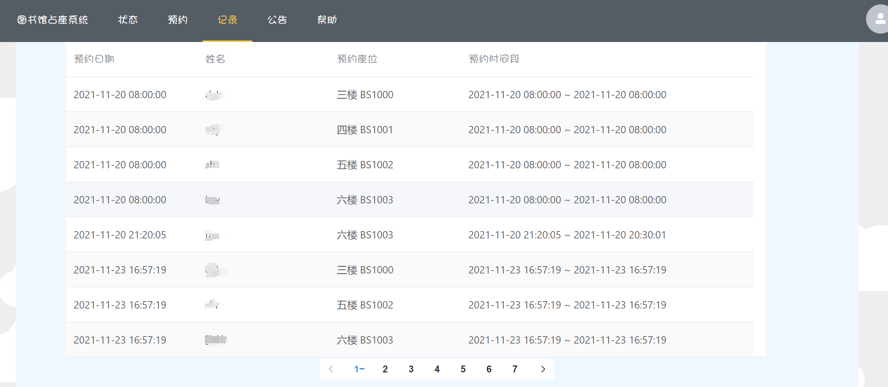

# library-occupancy-system

## Project setup
```
npm install
```

### Compiles and hot-reloads for development
```
npm run serve
```

### Compiles and minifies for production
```
npm run build
```

# 页面展示
## 登录页面


## 主页


## 预约


## 记录


## 公告


## 个人中心

